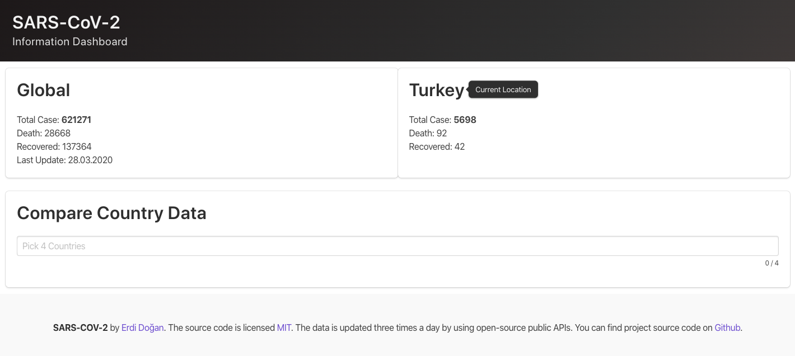
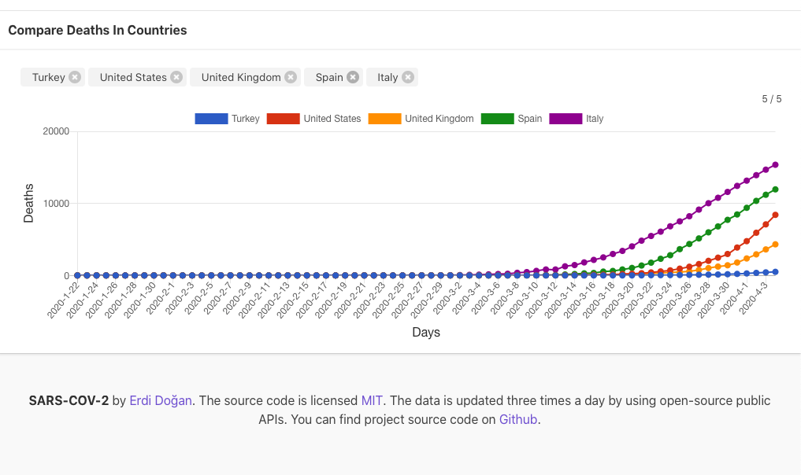
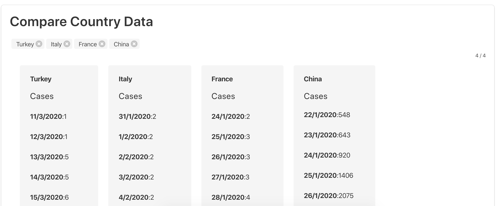

# SARS-CoV-2 UI 



An open-source covid19 data tracker project. 

## Feauteres

* Elegant, Simple UI
* Instant case search
* Instant Local Case Data View

* Compare the number of cases in countries



### Prerequisites
 Install latest version of 'node.js' and 'npm' in order to start development.
```
Vue 3 (Vue-Cli)
Buefy 
Axios
```

### Installing

Install dependencies
- Go to project directory and use the command below.

```
npm install
```

### Start Program

Go to project directory and use the command below

```
npm run serve 
```


## Built With

* [Vue 3](https://vuejs.org/) - The progressive javascript framework
* [Buefy](https://buefy.org/) - Lightweight UI Components
* [Axios](https://github.com/axios/axios) - Promise Based HTTP Client

## Open Source Public APIs

* [NovelCovid/API](https://github.com/NovelCOVID/API) - Local & Global Data Source 
* [Pomver/covid19](https://github.com/pomber/covid19) -  Compoare Data Source 


## Authors

 *[Erdi Doğan](https://www.linkedin.com/in/doganerdi) 


## License

This project is licensed under the MIT License 


