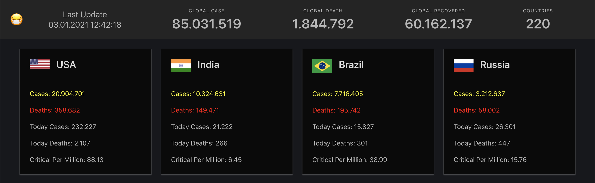

# SARS-CoV-2 UI 

An open-source covid19 data tracker project. 



## Feauteres

* Elegant, Simple UI
* Compare covid data between countries

### Install  & Start

Install dependencies
- Go to project directory and use the command below.

```
npm install
npm run serve 
```

## Built With

* [Vue ](https://vuejs.org/) - The progressive javascript framework
* [Buefy](https://buefy.org/) - Lightweight UI Components
* [Axios](https://github.com/axios/axios) - Promise Based HTTP Client

## Open Source Public APIs

* [NovelCovid/API](https://github.com/disease-sh/API) - Data Source 

## Authors

 [Erdi Doğan](https://www.linkedin.com/in/doganerdi) 


## License

This project is licensed under the MIT License 


